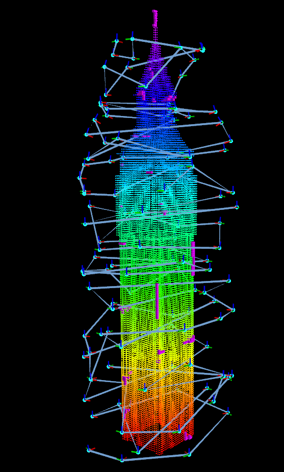
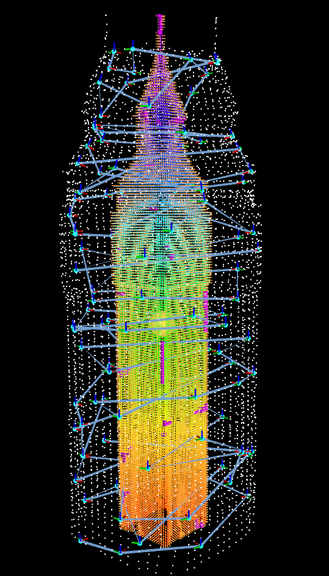

# MLCPP: Multi-layer coverage path planner for autonomous structural inspection of high-rise structures
+ The purpose of the algorithm is to inspect high-rise building with UAV or 3D reconstruction.
+ DOI: [10.1109/IROS.2018.8593537](https://doi.org/10.1109/IROS.2018.8593537)
+ If you use or refer this repository, please cite the paper below:

>Jung, S., Song, S., Youn, P. and Myung, H., 2018, October. Multi-layer coverage path planner for autonomous structural inspection of high-rise structures. In 2018 IEEE/RSJ International Conference on Intelligent Robots and Systems (IROS) (pp. 1-9). IEEE.

<br>

<p align="center">
  
  
  <br>
  <em>Left: Target and path. Right: full visualization</em>
</p>


<br>

## How to install
```bash
cd ~/<your_workspace>/src
git clone https://github.com/sungwook87/mlcpp
cd ..
catkin build
```

<br>

## How to run
+ Edit some parameters in `main.launch` file
```bash
roslaunch mlcpp main.launch
rostopic pub /calculate_cpp std_msgs/Empty
```